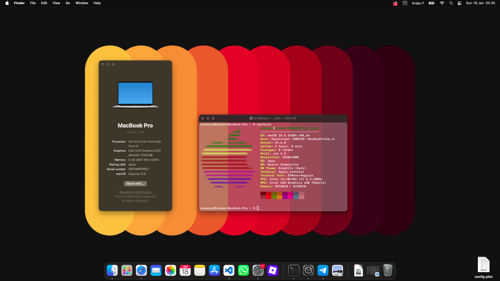
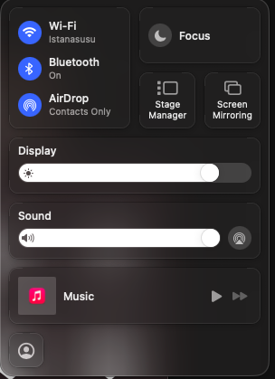
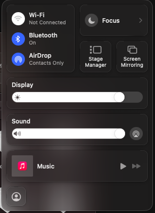
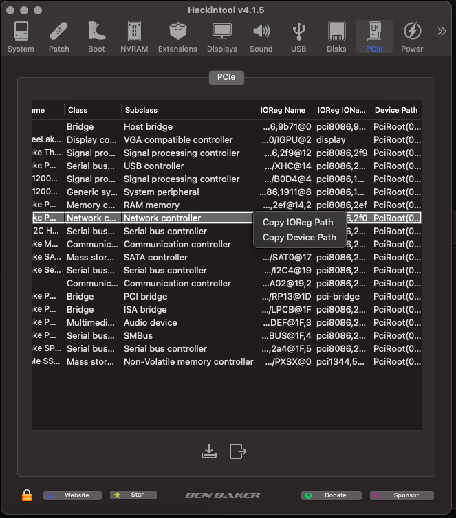
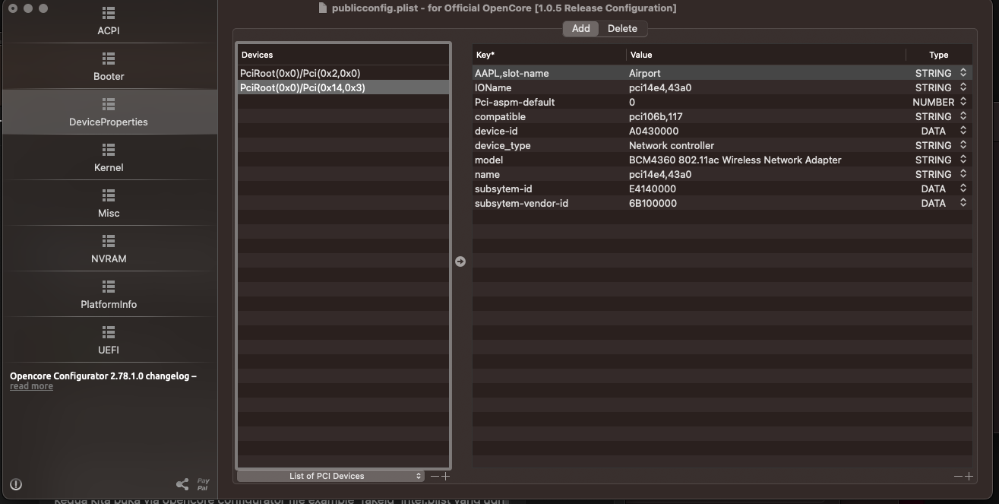
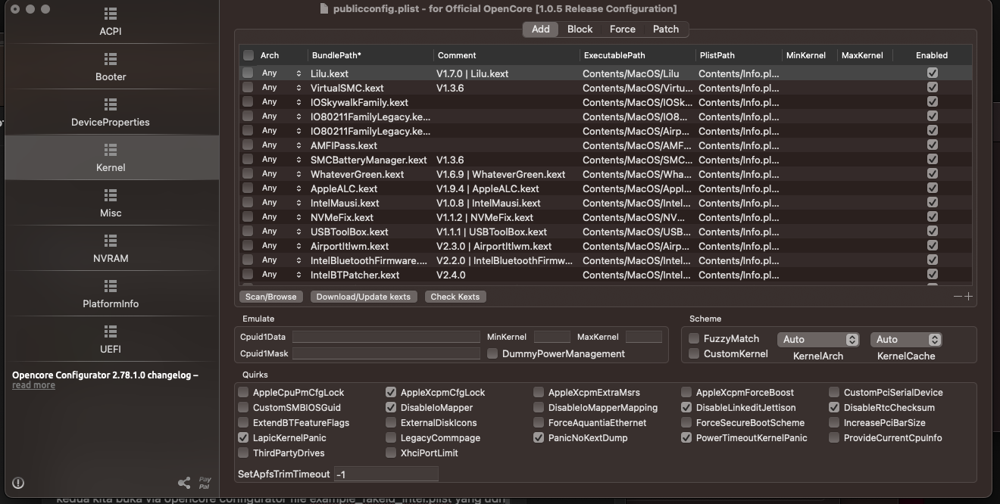
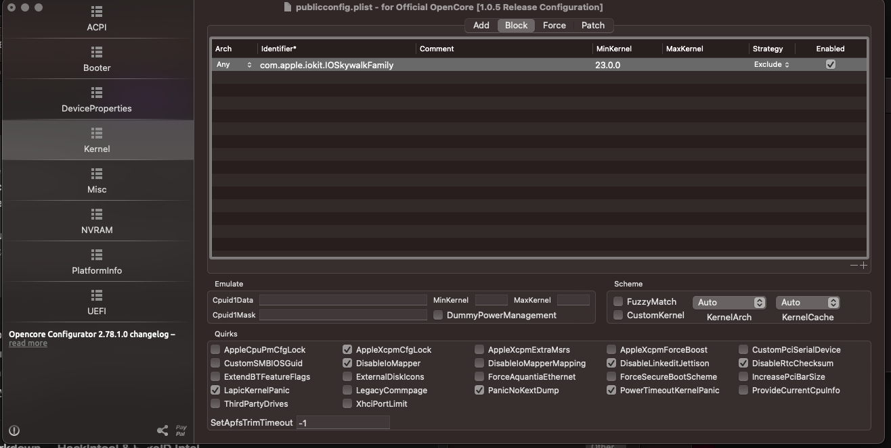
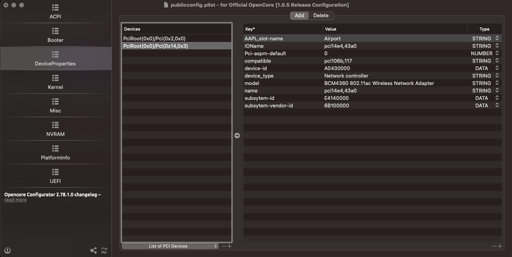

# — Hackintosh EFI Setup

> Ini buat kalian yang agak kesel sama Windows, tapi pengen ada Adobe atau aplikasi yang jalan diwindows tapi gaada samsek di Linux, Daripada balik lagi ke Windows mending kesini (pemikiran gua kemaren sih ini)



## 🎯 Project
Dokumentasi aja lah ini 8 Bulan, jerih payah dan kena bully di grup (sampe sekarang juga kadang ga mudeng wkwk)
❗ SMBIOS & Serial Info TIDAK disertakan di repo ini demi keamanan identitas AppleID / iCloud lo sendiri. Buat milih SMBIOS yang cocok, generate manual pakai tool yang bener.
> Kalo Laptop lo sama ama gue ampe ke akar akarnya kata gue si bedain diserial numbernya aja gapapa, beda seri Intel beda cerita SMBIOS nyangkut kemana


# 💻 Lenovo Ideapad 3-14IML05 Hackintosh Specs

## 💻 System Specs

| Component | Detail |
| :--- | :--- |
| **Model Type** | Lenovo IdeaPad Slim 3 14IML05 |
| **Processor** | Intel® Core™ i3-10110U @ 2.10GHz (Comet Lake) |
| **Graphics** | Intel® UHD Graphics 630 (CML GT2) |
| **Memory** | 8GB DDR4 2667MHz (4GB Soldered + 4GB Lexar) |
| **Audio** | Realtek ALC257 (Layout-ID: [lupa]) |
| **Trackpad** | I2C HID-compliant (MSFT0001) |
| **Storage** | 512GB Micron MTFDHBA512QFD NVMe SSD |
| **Wireless LAN** | Intel® Wireless-AC 9560 |
| **Bluetooth** | Intel® Wireless Bluetooth® |
| **Bootloader** | OpenCore 1.0.5 |
| **SMBIOS** | MacBookPro16,3 (2019) |
| **OS Version** | macOS Sequoia 15.6 (Olarila) |

---

### 🛠️ Notes on this EFI:
* **SMBIOS**: Serial Number, Board Serial, dan UUID sudah di-generate ulang (Silakan generate sendiri untuk keamanan iCloud).
* **OS Support**: Tested on macOS Sequoia 15.6.
* **Kexts**: Menggunakan kombinasi kext standar dan beberapa patch khusus untuk WiFi/BT di Sequoia.
* **SEBELUM LANJUT** : kalo pengen install MacOS, Baca dari sini aja dulu 
* **Dortania's Webpage** [mau baca?](https://dortania.github.io/OpenCore-Install-Guide/)


# Struktur EFI Folder 
``` bash 
EFI/
 ├── BOOT/
 │    └── BOOTx64.efi
 └── OC/
      ├── ACPI/
      ├── Drivers/
      ├── Kexts/
      ├── Resources/
      ├── Tools/
      └── config.example.plist
```

## Kexts + Link 

---

## ⚙️ Core & System

| Kext | Fungsi | Catatan |
|------|---------|----------|
| **[Lilu.kext](https://github.com/acidanthera/Lilu)** | Nyawanya Hackintosh | Wajib ada, semua patch kext lain bergantung ke sini. |
| **[VirtualSMC.kext](https://github.com/acidanthera/VirtualSMC)** | Emulator SMC | Biar macOS mikir ini beneran Mac. |
| **[WhateverGreen.kext](https://github.com/acidanthera/WhateverGreen)** | Grafik patcher | Buat urusan IGPU (Intel UHD). |
| **[NVMeFix.kext](https://github.com/acidanthera/NVMeFix)** | SSD NVMe optimizer | Hematin daya dan ningkatin stabilitas. |
| **[CpuTscSync.kext](https://github.com/acidanthera/CpuTscSync)** | Sinkronisasi CPU TSC | Biar gak kernel panic pas boot atau sleep. |

---

## 🔊 Audio & Input

| Kext | Fungsi | Catatan |
|------|---------|----------|
| **[AppleALC.kext](https://github.com/acidanthera/AppleALC)** | Audio driver | Biar speaker & mic hidup. |
| **[VoodooI2C.kext](https://github.com/VoodooI2C/VoodooI2C)** + **VoodooI2CHID.kext** | Trackpad & gesture | Duet maut biar bisa swipe ala Macbook. |
| **[VoodooPS2Controller.kext](https://github.com/acidanthera/VoodooPS2)** | Keyboard bawaan | Biar tombol keyboard hidup normal. |
| **[BrightnessKeys.kext](https://github.com/acidanthera/BrightnessKeys)** | Shortcut kecerahan | Biar tombol F1/F2 gak useless. |

---

## 🌐 Network (Wi‑Fi & Bluetooth)

| Kext | Fungsi | Catatan |
|------|---------|----------|
| **[itlwm.kext](https://github.com/OpenIntelWireless/itlwm)** | Intel Wi‑Fi driver | Butuh app **HeliPort** buat connect. Kalo mau native, ganti ke **AirportItlwm**. |
| **[IntelMausi.kext](https://github.com/acidanthera/IntelMausi)** | Intel Ethernet | Buat port LAN biar gak nganggur. |
| **[BlueToolFixup.kext](https://github.com/acidanthera/BrcmPatchRAM)** + **[IntelBluetoothFirmware.kext](https://github.com/OpenIntelWireless/IntelBluetoothFirmware)** + **[IntelBTPatcher.kext](https://github.com/OpenIntelWireless/IntelBluetoothFirmware)** | Bluetooth stack | Trio wajib biar Bluetooth hidup di macOS Monterey ke atas. |

---

## 🔋 Power & USB

| Kext | Fungsi | Catatan |
|------|---------|----------|
| **[SMCBatteryManager.kext](https://github.com/acidanthera/VirtualSMC)** | Battery indicator | Munculin persentase baterai di menu bar. |
| **[USBToolBox.kext](https://github.com/USBToolBox/tool)** + **[XHCI-unsupported.kext](https://github.com/dortania/OpenCore-Install-Guide/blob/master/clover-conversion/usb.md)** | USB mapping | Biar port gak acak-acakan. |

---

# 🛠️ Installation Guide

Ikutin step-step di bawah ini biar nggak kernel panic pas booting.  
> Inget, ini buat **Lenovo Ideapad 3-14IML05 (Comet Lake)**.
> Bisa buat Laptop lain, steps sama. tapi ur on your own kid.
> ga bertanggung jawab kalo laptop lu cuman bisa jadi tempat dudukan kucing nanti (bricked)

---

### 1. Clone & Prepare
Pertama, tarik dulu repo ini ke lokal lu:

```bash
git clone https://github.com/ardan-su/Macintosh-on-Lenovo-Ideapad.git

cd Macintosh-on-Lenovo-Ideapad
cp config.example.plist config.plist
```

### 2. Generate SMBIOS (Wajib!)
Jangan pake Serial Number orang lain, nanti Apple ID lu bisa ke-ban.
- Download GenSMBIOS.
- Pilih opsi Generate SMBIOS.
- Masukkan model: MacBookPro16,3.
- Masukkan Type, Serial, Board Serial, dan SmUUID ke config.plist di PlatformInfo > Generic.

### 3. EFI Deployment
Copy folder BOOT dan OC ke partisi EFI Flashdisk atau SSD lu.
Struktur folder yang bener:

``` bash
EFI
├── BOOT
│   └── BOOTx64.efi
└── OC
    ├── ACPI/
    ├── Drivers/
    ├── Kexts/
    ├── Resources/
    ├── OpenCore.efi
    └── config.plist
```
### 4. BIOS Settings (Lenovo)
> Pastikan settingan BIOS bener biar nggak mentok di logo.
Disable:

- Fast Boot
- Secure Boot
- Intel SGX
- Virtualization (opsional)
- Enable:
- UEFI Mode
- AHCI


---

## 🍁 Sequoia Patch (OCLP Stuff)

| Kext | Fungsi | Catatan |
|------|---------|----------|
| **IOSkywalkFamily.kext** | Framework networking | Patch dari OCLP buat Wi‑Fi lama di Sequoia. |
| **IO80211FamilyLegacy.kext** | Legacy Wi‑Fi driver | Masih dibutuhin biar Wi‑Fi gak mati total. |
| **AMFIPass.kext** | AMFI bypass | Biar OCLP bisa nge‑patch sistem tanpa error. |

---

## 🧩 Catatan Tambahan
- Semua kext di atas **bisa di‑download langsung dari GitHub official-nya** (linknya udah dianuin).  
- `config.plist` lo pastiin udah sesuai urutan **Kernel → Add**.  
- Jangan upload SMBIOS lo ke repo publik kalau gak mau kena blacklist iMessage.
- kext gua masih berantakan, jadi coba sendiri dah ya. Gua orangnya "if it works don't touch it"

---

## ⚡ Quick Command

```bash
# Clone repo ini
git clone https://github.com/username/hackintosh-sequoia-efi.git

# Edit config
cp config.example.plist config.plist
# lalu generate SMBIOS pakai GenSMBIOS
```
___

## 🛠 Root Patch Overview


> Ini dilakukin bila kalian pengen banget wifi native di sequoia 15.6




Biar Gampang, Dibikin Backup dulu EFI takutnya ada yang ke senggol sama OCLP nanti berabe.

Bahan Bahan yang diperlukan 

- OCLP
- fakeid (jadi spoofing supaya wifi card intel lu jadi Broadcom punya Apple sayang Broadcom)
- kexts liat table **sequoia patch**
- Opencore Legacy Patcher ( OCLP )
- Opencore Configurator
- Hackintool

> Tip: siapkan kacamata baca, karna essensialnya kita bakal Spoofing atau lebih dikenal pura pura, spoofing agar wifi card intel ini menjadi broadcom, kesayangannya Apple. 

## 🧠 Root Patch: Network Spoof via Hackintool + OpenCore Configurator

Kalo udah siap, buka **Hackintool**, terus ke tab **PCIe**.  
Cari bagian **Network Controller**, klik kanan, terus pilih **Copy Device Path** —  
> ⚠️ Bukan yang *ioreg*, tapi yang *Device Path* ya.



---

Sekarang buka **OpenCore Configurator**, terus load file `example_fakeid_intel.plist`  
yang udah lo siapin dari Google Drive.  
Masuk ke bagian **DeviceProperties**, terus **paste Device Path** yang tadi dicopy dari Hackintool.



---

Kalau udah kayak gitu, lanjut buka **config.plist asli** lo.  
Masuk ke tab **Kernel**, lalu tinggal **drag & drop kext‑kext yang baru**.  
Taruh **di bawah Lilu dan VirtualSMC** biar urutannya aman.



Masih di tab **Kernel**, buka sub‑tab **Block**, terus tambahin `iokit.IOSkywalkFamily`.



---

Simpan konfigurasi lo, lalu **restart laptop**.

---

Setelah restart, buka lagi **OpenCore Configurator**.  
Balik ke **DeviceProperties**, dan di device spoofingan yang baru tadi lo tambahin,  
kasih pagar `#` di depan key‑nya.  

> Tujuannya biar device spoof itu gak aktif terus setiap boot,  
> karena nanti macOS bakal nyari “perasaan gue ada Broadcom keinstall, kok gamau ya dia?”




---

---

## 🐞 Bug Tracker & Workarounds

### 🔴 Known Major Bugs
| Bug | Description | Workaround |
| :--- | :--- | :--- |
| **Sleep/Wake** | Langsung Kernel Panic kalau sleep normal. Ibarat orang tidur, bangun-bangun langsung dilelepin di kolam lele. | Pakai shortcut `Cmd` + `Ctrl` + `Q` buat masuk ke Lock Screen dulu, baru sleep dari situ. |

### 🟡 Known Minor Bugs
* **Display Unknown**: Di "About This Mac" kedetek Unknown. Tapi selagi pixelnya masih muncul dan gambar ada, mending gausah digubris. 🤫
* **Trackpad in Bootloader**: Trackpad mati pas di menu OpenCore. Pakai keyboard dulu ya, kalau udah masuk OS baru normal lagi.
* **And more**: Sisanya cari sendiri, itung-itung latihan searching, tanya orang stack overflow, tanya orang xda dev, banyak dah, biar mata lu makin jeli juga.

### 🟢 Fixed Bugs
* **None**: Lu kata gue developer Apple? Gue cuma nyocok-nyocokin kexts doang bang! 😭

---

## ⚡ Minor Changes (Tweaks)

Berbeda dari instalasi standar, EFI ini punya beberapa "bumbu" tambahan:
* **Clean Startup**: No Verbose log (layar item tulisan putih yang pusing itu udah di-disable). Kalau mau debug, tinggal nyalain lagi di `boot-args`.
* **Legendary Startup Chime**: Udah ada *startup sound* macOS yang legendaris tiap kali booting. Berasa pake Mac asli harga 20 juta! (kalo speaker lo ga sember)
* **Basic is Better**: Semuanya dibuat se-basic mungkin biar nggak gampang *ngacau* atau rusak sistemnya.


---

✅ **Selesai.**  
Sekarang root patch udah diterapin, spoof device aman, dan sistem gak bakal nyangkut di driver palsu.

Selamat Menikmati nikmatnya OS Unix yang dikekang kaya ortu dari seorang Anak tunggal yang apa apa kaga boleh wkwk


---

## 🧠 License
Lisensi: [CC BY‑NC 4.0](https://creativecommons.org/licenses/by-nc/4.0/)  
Lo boleh belajar dan pakai, asal gak dijual ulang dan tetep kasih kredit.

---
## 💸 Credits
- Dortania's Webpage tentang Hackintosh [mau baca?](https://dortania.github.io/OpenCore-Install-Guide/) — panduan lengkap buat Hackintosh, mulai dari SMBIOS, kext, ACPI, sampai config.plist.
- [OpenCorePkg GitHub](https://github.com/acidanthera/OpenCorePkg) — repo resmi OpenCore.
- [OpenCore Legacy Patcher (OCLP)](https://github.com/dortania/OpenCore-Legacy-Patcher) — buat patch macOS lama atau Sequoia khusus hardware lawas.

---

### 💀 Disclaimer
Gue bukan Apple Genius Bar, tapi ini build jalan, stabil, dan gue pake tiap hari.  
Lo gagal boot? Ya pelajari log‑nya, bukan nyalahin repo orang lain.
